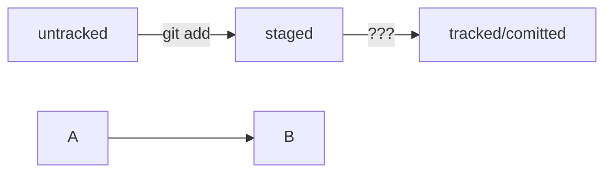

# git-hints

## Небольшой гит-репозиторий для самостоятельной работы

`git clone https://github.com/PraktikumJava/git-hints.git`

## Хэш
цифры и буквы после commit

закодированный текст коммита

## Лог
вызов

git log

появляется список коммитов с их описанием

## HEAD
Самый последний коммит

(HEAD -> master)

## Статусы файлов
untracked - неотслеживаемый, новые файлы

tracked - отслеживаемый, после git commit

staged - подготовленный, после git add

modified - измененный

## Стили оформления сообщений к коммитам
Должны быть информативные сообщения

Исправлена ошибка #123

LGS-239: Дополнить список пасхалок новыми числами

Conventional Commits

"type:" <сообщение>

"type:" feat, fix

feat: добавить подсчет суммы заказов за неделю

Исправить #334, добавить график температуры